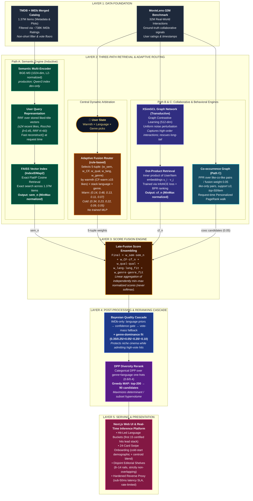

# CineMatch Inference Architecture

Master architecture documentation for CineMatch, a semantic, cross-cultural movie recommendation engine.

## System Diagram

The system diagram below illustrates the 5-layer modular production architecture deployed on Hugging Face Spaces (FastAPI) and Vercel (Next.js):

---

## Architectural Breakdown & Production Reality

| Layer / Component | Specification in Production | Rationale & Trade-offs |
| :--- | :--- | :--- |
| **Layer 1: Data Foundation** | TMDB (1.37M titles) joined with IMDb ratings (~738K titles) and MovieLens 32M interactions. | TMDB provides rich multilingual overviews/keywords; IMDb provides credible quality gates resistant to bot spam; ML-32M provides collaborative ground truth. |
| **Path A: Semantic Multi-Encoder** | `BGE-M3 (1024-dim, L2-normalized)`. Qwen3-4B (2560-dim) index retained as dev-only. | BGE-M3 provides native multilingual support across Indian regional languages and Western languages with low memory overhead. |
| **Path A: Query Representation** | Reciprocal Rank Fusion (RRF) over stored liked-title vectors ($\le 24$ recent likes, Rocchio $\beta=0.45$, RRF $K=60$). | Direct `reconstruct()` of stored title vectors avoids online LLM/BERT inference, maintaining sub-5ms lookup latency. |
| **Path A: FAISS Index** | `IndexIDMap2(IndexFlatIP)` cosine retrieval over normalized vectors. | Exact search prevents ANN recall dropouts on niche long-tail titles. |
| **Center: Adaptive Fusion Router** | Deterministic rule matrix selecting 5-tuple $(w_{\text{sem}}, w_{\text{CF}}, w_{\text{qual}}, w_{\text{lang}}, w_{\text{genre}})$. | **No trained MLP.** Calibrated against warmth ($\ge 15$ likes) $\times$ stack language $\times$ active genre picks. Prevents modality collapse. |
| **Path B: XSimGCL Collaborative** | 512-dim node embeddings trained via RecBole-GNN with uniform noise augmentation. | Uniform noise perturbation creates contrastive views without expensive edge dropping; InfoNCE loss pulls positive user-item interactions together. |
| **Path C: Co-occurrence Graph** | Item-item graph mined from like-only pairs (support $\ge 3$, top-50/item); request-time Personalized PageRank (PPR). | Fused with weight $0.05$ to unearth non-obvious cross-genre recommendations backed by behavioral co-views. |
| **Layer 3: Late-Fusion Formula** | $\text{Final} = w_{\text{sem}}\cdot\text{sem}_n + w_{\text{CF}}\cdot\text{cf}_n + w_{\text{qual}}\cdot\text{qual} + w_{\text{lang}}\cdot\text{lang\_fit} + w_{\text{genre}}\cdot\text{genre\_fit}$ | Linear aggregation over independently min-max normalized signals. Softmax is explicitly avoided to preserve relative scale calibration. |
| **Layer 4: Quality & Dominance** | Tri-tier IMDb Bayesian cascade + genre-dominance fit $(0.35/0.25/+0.05/-0.20/-0.10)$. | Replaces heavy cross-encoders; protects low-vote indie cinema while admitting high audience demand ($10\text{k}+$ votes) cult hits. |
| **Layer 4: Diversity Rerank** | Categorical DPP over genre + language one-hot vectors ($0.6/0.4$), greedy MAP top-200 $\to 90$. | Maximizes kernel determinant (hypervolume), overcoming MMR's greedy local optima. |
| **Layer 5: Presentation** | Next.js 16 Web UI with hit-led language stacks (`hit_lead_k=15`), 24-card Tinder swipe onboarding, disjoint rails. | Stacks open on certified audience hits; editorial rails never duplicate cards. |
